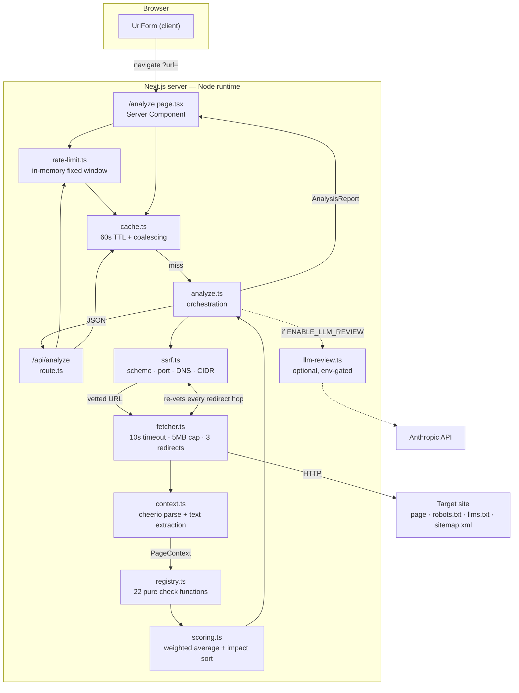

# Envoyix

Audit any public URL for **Generative Engine Optimization (GEO)** — how readily AI answer engines (ChatGPT, Perplexity, Claude, Gemini, Google AI Overviews) can crawl a page, understand it, and cite it as a source.

The site is also built to be a worked example of its own advice: it server-renders everything, ships JSON-LD on every route, publishes `llms.txt` and `llms-full.txt`, and names the AI crawlers explicitly in `robots.txt`. It scores **97/100** on its own analyzer, with all 22 checks passing.

---

## What is GEO?

Generative Engine Optimization is the practice of structuring web content so that AI answer engines can extract and cite it. Where SEO competes for a position in a ranked list of ten links, GEO competes to be the passage quoted inside a single generated answer.

Three technical realities drive the difference:

| | Classic SEO | GEO |
|---|---|---|
| The prize | A position in a list of links | Being the cited source in one answer |
| JavaScript | Googlebot renders it | Most AI crawlers read raw HTML only |
| Unit of competition | The page | The passage, chunked and embedded |
| Success metric | Clicks and position | Citation frequency |

The three guides under `/learn` cover this in depth.

---

## Architecture



### The shape that matters

Every check is a **pure function** `(ctx: PageContext) => CheckResult`. No check performs I/O. All fetching happens once, up front, in `analyze.ts`, and the results are frozen into a `PageContext` that the checks read. That is what makes all 22 checks unit-testable against static HTML fixtures with no network and no mocks.

Three things in `analyze.ts` exist purely to keep an audit fast:

- **The sibling files are fetched concurrently with the page.** `robots.txt`, `llms.txt` and the sitemap sit at fixed paths, so they are requested against the submitted origin at the same time as the page itself rather than after it. If the page then redirects to a *different* origin, the speculative results are discarded and re-fetched from wherever it landed — the common case saves a full round trip, the rare case costs three GETs of public text files.
- **The sitemap tries `/sitemap.xml` alone first.** Only if that misses do `/sitemap_index.xml` and `/sitemap-index.xml` go out, together. Firing all three every time would triple the requests made to a stranger's server to speed up the minority case.
- **The optional AI review is not awaited by the page.** `analyzePage()` returns the deterministic report plus the review as a *pending promise*, so `/analyze` streams 22 checks into the response while the model is still working. `analyzeUrl()` awaits it, for the JSON API where there is nothing to stream into.

`cache.ts` memoises a finished audit for 60 seconds. It stores the in-flight **promise**, not the resolved value, so two people auditing the same URL at the same moment share one fetch instead of racing two. Rejections are evicted immediately — a site that was briefly unreachable is retried, not remembered as broken.

```
src/
  app/
    page.tsx                      # home — URL input, GEO vs SEO, scoring explainer
    analyze/page.tsx              # results, rendered on the server
    learn/page.tsx                # guide index
    learn/[slug]/page.tsx         # MDX guide + Article/FAQPage/BreadcrumbList JSON-LD
    learn/[slug]/opengraph-image.tsx
    about/page.tsx  faq/page.tsx
    api/analyze/route.ts          # POST { url } → AnalysisReport   (runtime = "nodejs")
    robots.ts  sitemap.ts         # generated from the same data the app uses
    llms-full.txt/route.ts        # every guide's Markdown, in one file
    opengraph-image.tsx  icon.svg
  components/                     # Logo, PageHeader, ScoreGauge, CheckCard, CheckMatrix,
                                  #   CategoryScores, UrlForm, JsonLd, ThemeToggle…
  content/guides/*.mdx            # guide sources — also served at /llms-full.txt
  lib/
    site.ts  faq.ts  guides.ts    # site config, FAQ data, MDX loader (Zod-validated)
    geo/
      types.ts                    # CheckResult, PageContext, AnalysisReport
      ssrf.ts                     # SSRF guard
      fetcher.ts                  # capped, redirect-vetting fetch
      context.ts                  # PageContext builder + text extraction
      robots-txt.ts               # RFC 9309 parser + AI bot registry
      schema.ts                   # JSON-LD extraction and validation
      readability.ts              # Flesch + sentence/syllable counting
      scoring.ts                  # weighted average, categories, impact
      cache.ts                    # 60s TTL promise cache + request coalescing
      registry.ts                 # the check list + report builder
      report.ts                   # Markdown export
      rate-limit.ts  llm-review.ts  normalise-url.ts
      checks/
        crawlability/  structure/  authority/  content/
tests/
  fixtures/{good,bad,js-only}-page.html
  ssrf.test.ts crawlability.test.ts structure.test.ts authority.test.ts
  content.test.ts scoring.test.ts cache.test.ts
```

---

## How the score works

Each check returns a score of 0–100 and declares a **weight** reflecting how much it affects the chance of being cited. The overall score is the weighted average:

```
overall = Σ(score × weight) / Σ(weight)
```

Weighted rather than flat because the checks are not equally consequential: a `robots.txt` rule blocking `OAI-SearchBot` makes every other check irrelevant (weight 10), while a missing `og:image` costs a little polish (weight 3). Weights live in the check modules themselves, so adding a check cannot silently rescale the others.

Findings are sorted by **impact**:

```
impact = weight × (100 − score)
```

That is how many overall points fixing the check would recover, which puts "heavy check, badly failed" at the top — the order actually worth working in. A hard-failed light check is less urgent than a half-passed heavy one.

Status bands: `pass` ≥ 80, `warn` ≥ 50, `fail` below. Derived centrally in `scoring.ts`, so no check can report a status that disagrees with its own number.

### The 22 checks

| Category | Checks | Weight |
|---|---|---|
| **Crawlability** — can an engine fetch it? | AI crawler access in robots.txt | 10 |
| | Content present without JavaScript | 10 |
| | HTTP response health | 8 |
| | Indexing directives (meta robots, X-Robots-Tag) | 7 |
| | XML sitemap | 5 |
| | `/llms.txt` present | 3 |
| **Structure** — can it find the answer? | Heading hierarchy | 8 |
| | Question-style headings | 6 |
| | FAQ section | 6 |
| | Lists and tables | 5 |
| | Paragraph length | 4 |
| **Authority** — is there reason to trust it? | JSON-LD structured data | 9 |
| | Author and publisher attribution | 6 |
| | Publish and update dates | 5 |
| | Outbound citations | 5 |
| | Canonical URL | 5 |
| **Content** — is the prose quotable? | Direct answer in the opening | 9 |
| | Quotable, self-contained sentences | 7 |
| | Statistics and concrete figures | 6 |
| | Readability (Flesch) | 5 |
| | Title and meta description | 4 |
| | Open Graph and Twitter tags | 3 |

AI crawlers are weighted individually by `citationImpact` (see `robots-txt.ts`): blocking `OAI-SearchBot` or `PerplexityBot` — which fetch pages to answer a live question — costs far more than blocking `CCBot`, which builds a training corpus. Blocking training crawlers is a legitimate editorial choice and is scored as such.

---

## Design

The visual language is defined entirely as CSS custom properties in `src/app/globals.css` and exposed to Tailwind through `@theme inline`, so nothing in a component hard-codes a colour.

| Token | Light | Dark | Used for |
|---|---|---|---|
| `--background` | `#fcfbf7` warm paper | `#0b0b0d` neutral near-black | Page ground |
| `--surface` / `--surface-raised` | `#f4f2ea` / `#ffffff` | `#141417` / `#1a1a1f` | Section bands, cards |
| `--border` / `--border-strong` | `#e6e2d5` / `#d2ccb9` | `#2a2a31` / `#3d3d47` | Rules, card edges, hover |
| `--accent` | `#1b46d8` | `#8aa8ff` | Links, primary buttons, the mark |
| `--pass` / `--warn` / `--fail` | `#0f7038` / `#8f5405` / `#b81237` | `#4ec97f` / `#e9b23c` / `#ff7a92` | Check status |

Light mode is warm paper rather than cool grey: it separates the chrome from the blue accent without extra borders, and keeps long guide copy comfortable. Dark mode is a neutral near-black with no blue cast, so the status colours are the only saturated thing on screen.

Type is three faces, all self-hosted by `next/font` (no render-blocking request to Google, no layout shift): **Space Grotesk** for headings via `--font-display`, **Inter** for body copy, **JetBrains Mono** for URLs, scores and the `.eyebrow` label style.

Two rules the components hold to, because they are the same rules this tool grades other sites on:

- **Status is never colour alone.** Every coloured marker is paired with a text label or an `sr-only` description — see `CheckCard` and `CheckMatrix`.
- **Disclosure without JavaScript.** Expandable content uses `<details>`/`<summary>`, so findings and FAQ answers are present in the server HTML whether or not they are open. A JS accordion would hide all of it from the crawlers that matter.

Dark mode is class-based (`.dark` on `<html>`, stamped before paint by `ThemeScript`) so the header toggle can override the OS setting; the `prefers-color-scheme` media query is the fallback when no class is set.

---

## Local setup

Requires **Node 20.9+** (Next.js 16 minimum) and **pnpm**.

```bash
pnpm install
cp .env.example .env.local     # optional — every variable has a default
pnpm dev                       # http://localhost:3000
```

### Scripts

| Command | What it does |
|---|---|
| `pnpm dev` | Dev server (Turbopack, the Next 16 default) |
| `pnpm build` | Production build |
| `pnpm start` | Serve the production build |
| `pnpm lint` | ESLint flat config (`next lint` was removed in Next 16) |
| `pnpm typecheck` | `next typegen && tsc --noEmit` |
| `pnpm test` | Vitest, 183 tests |
| `pnpm test:watch` | Vitest in watch mode |

### Using the API directly

```bash
curl -X POST http://localhost:3000/api/analyze \
  -H 'content-type: application/json' \
  -d '{"url":"https://example.com"}'
```

Returns a typed `AnalysisReport`. Errors return `{ error, code }` with `code` one of `INVALID_INPUT`, `SSRF_BLOCKED`, `FETCH_FAILED`, `RATE_LIMITED`, `INTERNAL`.

---

## Adding a new check

1. **Create the module** in `src/lib/geo/checks/<category>/<id>.ts`. Default-export a `CheckFn` and build the result with the `result()` helper so `status` is derived from `score` rather than set by hand:

   ```ts
   import type { CheckFn } from "../../types";
   import { result } from "../helpers";

   const checkHreflang: CheckFn = (ctx) => {
     const tags = ctx.$('link[rel="alternate"][hreflang]').toArray();
     return result({
       id: "hreflang",
       label: "Language alternates",
       category: "crawlability",
       score: tags.length > 0 ? 100 : 0,
       weight: 3,
       findings: [`${tags.length} hreflang alternate(s) declared.`],
       fix: "Declare a <link rel=\"alternate\" hreflang> for each translation.",
     });
   };

   export default checkHreflang;
   ```

2. **Register it** — add the import and one line to `CHECKS` in `src/lib/geo/registry.ts`. Nothing else in the pipeline changes; weights are declared by the checks, so existing scores are not rescaled.

3. **Test it** against the fixtures in `tests/fixtures/`. Add a `describe` block to the matching `tests/<category>.test.ts`. Cover the good page, the bad page, and at least one hand-built edge case.

Rules for a check: it must be pure (no I/O, no clock — use `ctx.fetchedAt`), it must produce findings about *this* page rather than generic advice, and `fix` must be one concrete action.

---

## Security

The analyzer fetches a user-supplied URL from the server, which is a textbook **SSRF** sink. The guard in `src/lib/geo/ssrf.ts` has two halves, both required:

1. **`assertSafeUrl`** — rejects non-http(s) schemes, URLs with credentials, non-standard ports, localhost-style hostnames and internal TLDs; then resolves DNS and rejects if **any** returned address falls in a private, loopback, link-local, CGNAT, multicast or reserved range (IPv4 and IPv6, including IPv4-mapped forms like `::ffff:127.0.0.1` and 6to4).
2. **Per-hop re-vetting** — `fetcher.ts` sets `redirect: "manual"` and runs the guard again on every hop, because a public URL is free to `302` straight at `169.254.169.254`.

Other limits: 10s timeout, 5 MB streamed body cap (enforced while reading, not from the advisory `Content-Length`), max 3 redirects, and an identifying User-Agent.

`tests/ssrf.test.ts` enumerates the blocked ranges — 49 assertions covering loopback, RFC 1918, link-local/metadata, CGNAT, TEST-NET, multicast, reserved, and the IPv6 equivalents.

---

## Known limitations

- **In-memory rate limiting.** `rate-limit.ts` keeps a `Map` per process. On Vercel each serverless instance has its own, so the effective limit is *(10/min × instances)*, and state is lost on cold start. **Replace with Upstash Redis or Vercel KV before running this publicly** — the module is a drop-in seam.
- **In-memory report cache.** `cache.ts` is per-process for the same reason, so the hit rate in production is lower than it is locally and the cache is empty after every cold start. That is harmless — it is an optimisation, never a correctness requirement — but it does mean the 60-second window is per instance, not global.
- **DNS rebinding (TOCTOU).** The guard resolves and vets the addresses, but the kernel resolves again when connecting. Closing this fully needs a custom `lookup`/agent pinning the connection to the vetted IP.
- **No JavaScript execution.** Deliberate — it matches what most AI crawlers do — but it means a client-rendered page is scored as those crawlers see it, not as a browser does.
- **Heuristics, not a published formula.** No answer engine documents how it selects sources. The weights encode what is publicly known plus reasonable inference. They are visible and commented in each check module; treat the score as a structural readiness signal, not a ranking prediction.
- **Bot protection.** Cloudflare and similar services will challenge the analyzer's User-Agent on some sites, producing a fetch failure. That is itself a finding — AI crawlers hit the same wall.
- **English-only content heuristics.** Flesch scoring, question-word detection and definition patterns assume English.

---

## Deploying to Vercel

```bash
pnpm i -g vercel
vercel link

# Optional — only if you want the AI review step:
vercel env add NEXT_PUBLIC_SITE_URL production   # https://your-domain.com
vercel env add ENABLE_LLM_REVIEW production      # true
vercel env add ANTHROPIC_API_KEY production      # sk-ant-…
vercel env add ANTHROPIC_MODEL production        # claude-opus-5

vercel --prod
```

`vercel.json` raises `maxDuration` to 60s for the two analyzer routes; the default 10s is not enough for four upstream fetches. `export const runtime = "nodejs"` is set on `/api/analyze` and `/analyze` because the SSRF guard needs `node:dns`.

If you enable the LLM review, note that its own 45s client timeout can push a slow analysis past 60s. Raise `maxDuration` (Pro plans allow more) or leave the review off.

After deploying, set `NEXT_PUBLIC_SITE_URL` — without it, canonical URLs, Open Graph tags and `sitemap.xml` all point at the default domain.

---

## Stack

Next.js 16.3.6 (App Router, Turbopack) · React 19.2 · TypeScript 5.9 strict (no `any`, no `@ts-ignore`) · Tailwind CSS 4.3 · Zod 4.6 · cheerio 1.2 · next-mdx-remote 6 · Vitest 5 · `@anthropic-ai/sdk` (optional path only).
